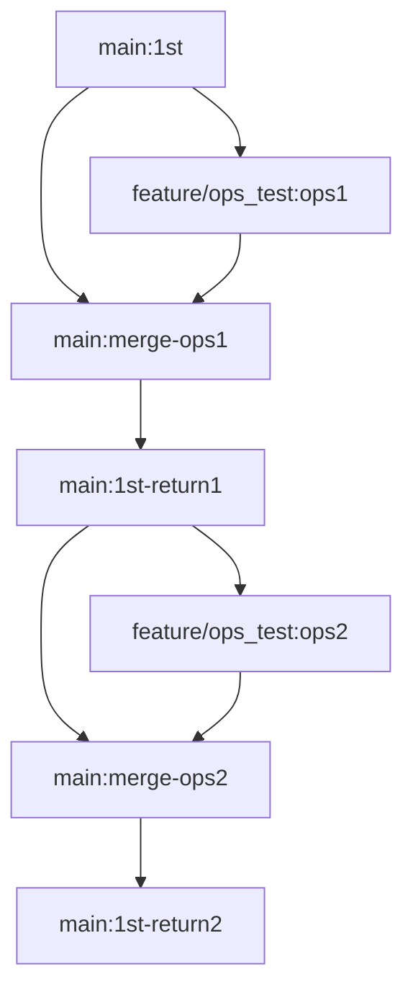

- 2024/5/15

# 
- データで制御できない異常系テストを、コードにバグを仕込んで実施したい
- `feature/ops_test` でバグを仕込んで `main` へマージしてデプロイ → テスト後 `main` に戻す をしたい

```
# 正常な状態のコミット(最終的にこのコミットに戻したい)
git add .
git commit -m "1st"
git push origin feature/ops_test

# テスト用バグ仕込む

git add .
git commit -m "ops_test_commit"
git push origin feature/ops_test

# マージ feature/ops_test -> main
# デプロイ
# テスト終了

git checkout main
git reset --hard <1st commit ID>
git add .
git commit -m "return 1st commit"
git push origin main --force
```





